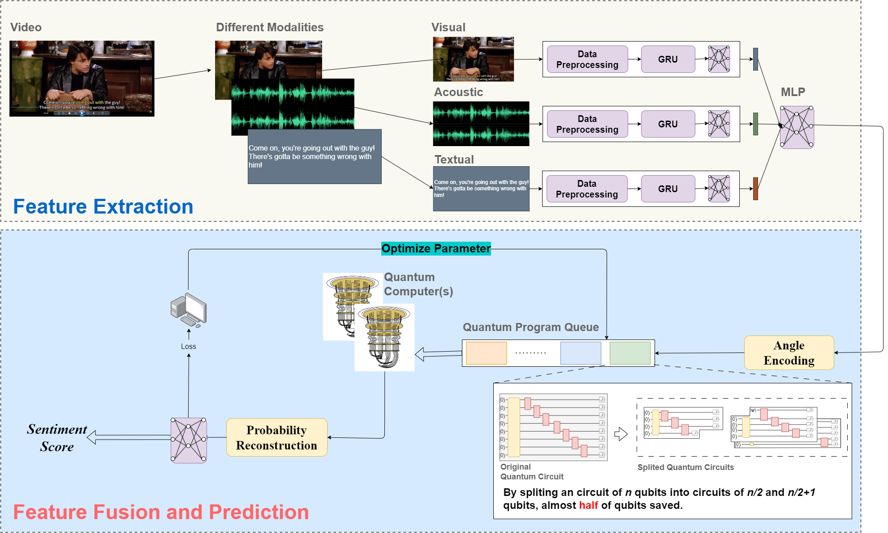

# QD-MSA: A Quantum Distributed Tensor Network Framework for Multimodal Sentiment Analysis 🔬✨

Welcome to the official repository for the paper "QD-MSA: A Quantum Distributed Tensor Network Framework for Multimodal Sentiment Analysis," published in Information Fusion. This project introduces a novel quantum-classical hybrid framework designed for multimodal sentiment analysis, specifically addressing the challenges of limited qubits in Noisy Intermediate-Scale Quantum (NISQ) devices.

## 🇨🇳 中文文档

For a Chinese version of this README, please see [README-CN.md](./README-CN.md).

## 🌟 Overview

In the age of social media and short videos, understanding emotional content from multiple modalities (audio, text, images) is crucial. Quantum computing, with its unique capabilities, holds promise for multimodal learning and fusion. However, current quantum hardware limitations, particularly qubit scarcity, hinder its practical application.

QD-MSA is the first framework to apply quantum circuit splitting techniques to multimodal sentiment analysis, effectively reducing qubit requirements and enabling the execution of more complex quantum programs on NISQ devices. Our framework also includes a distributed workflow for leveraging quantum computer clusters, significantly enhancing performance.

By combining classical neural networks for feature extraction and quantum models for feature fusion, QD-MSA achieves superior performance with remarkable parameter efficiency compared to classical deep learning methods.

## 📁 Repository Structure

```
.
├── common_models.py        # 🧠 Common classical neural network components (GRU, MMDL, Concat)
├── quantum_split_model.py  # ⚛️ Implementation of the quantum split model
├── quantum_unsplited_model.py # ⚛️ Implementation of the quantum unsplit model
├── example.py              # 🚀 Example script demonstrating model usage
├── pics/
│   ├── work_flow.png       # 🖼️ Illustration of the QD-MSA workflow
│   └── network_structure.png # 🖼️ Illustration of the network structure
├── README.md               # 📄 English README
└── README-CN.md            # 📄 Chinese README
```

## 🖼️ Model Illustration

Here are the key diagrams illustrating our framework:

**QD-MSA Workflow:**



**Network Structure:**


## 📝 Paper Information

**Title:** QD-MSA: A Quantum Distributed Tensor Network Framework for Multimodal Sentiment Analysis

**Journal:** Information Fusion

**Abstract:**

Multimodal sentiment analysis, which integrates data types such as audio, text, and images, is increasingly vital for understanding emotional content in the era of social media and short video platforms. Quantum computing, with its inherent characteristics like superposition and entanglement, is conceptually well-suited for multimodal learning, particularly for modal fusion. However, current quantum computers face limitations, such as a restricted number of usable qubits, hindering their ability to surpass classical computing (quantum supremacy). In this work, we propose QD-MSA, a quantum distributed multimodal sentiment analysis framework, which is the first to apply quantum circuit splitting techniques to multimodal sentiment analysis, reducing qubit usage from n to n/2 + 1. This advancement enables the execution of more complex quantum programs on Noisy Intermediate-Scale Quantum (NISQ) devices by partially overcoming qubit scarcity. Additionally, QD-MSA contains a novel workflow that integrates our model into quantum computer clusters, significantly enhancing computational performance and unlocking the potential of NISQ-era quantum computers. By combining classical neural networks for feature extraction with quantum models for feature fusion, our approach conserves quantum resources while achieving superior performance. Experimental evaluations on the CMU-MOSEI and CMU-MOSI datasets demonstrate that our model achieves comparable or superior performance to deep learning-based methods, with notable improvements in key metrics. Furthermore, our work represents the first successful integration of quantum computing principles into multimodal sentiment analysis, with experiments confirming that the proposed model significantly outperforms classical approaches relying solely on quantum-inspired strategies. These contributions establish a scalable and efficient framework for multimodal sentiment analysis, leveraging both classical and quantum computing paradigms to advance the field.

## ✨ Contributions

This work makes five key contributions:

1.  **Novel Distributed Workflow:** We propose a novel distributed workflow that integrates our quantum-hybrid model into clusters of quantum computers, significantly enhancing computational performance and unlocking the full potential of NISQ devices for complex multimodal sentiment analysis.
2.  **Pioneering Quantum Multimodal Sentiment Analysis Model:** We introduce a pioneering quantum multimodal sentiment analysis model that employs quantum encoding and quantum tensor networks to fuse diverse modalities. This contribution not only highlights a new application of quantum computing in the NISQ era but also underscores the importance of our approach in practical video analysis and human sentiment classification.
3.  **Remarkable Parameter Efficiency:** Our method achieves effective fusion of multiple modalities with remarkable parameter efficiency, requiring only 1% of the parameters used by conventional deep learning-based models in modal fusion, thereby enhancing both efficiency and scalability.
4.  **Quantum Circuit Splitting for Multimodal Sentiment Analysis:** We apply quantum circuit splitting techniques to the problem of multimodal sentiment analysis for the first time, reducing qubit usage from n to n/2 + 1, saving almost 50% of qubits. This significant reduction enables the execution of larger quantum circuits on devices with limited qubits.
5.  **Superior Performance:** Extensive experiments on the CMU-MOSEI and CMU-MOSI datasets demonstrate superior performance, with accuracies of 81.62% and 77.80% respectively, outperforming both state-of-the-art deep learning models and classical models that utilize quantum-inspired strategies.

## ➡️ Usage

To demonstrate the usage of the models, please refer to the `example.py` file.

```bash
python example.py
```

**Note:** This example file is provided to show how to instantiate and structure the model. Running it directly may require setting up the specific dataset loading and training pipeline which is not included in this simplified example.

## 🙏 Acknowledgements

This work was published in Information Fusion. Please cite our paper if you use this code or framework in your research.

```bibtex

```
